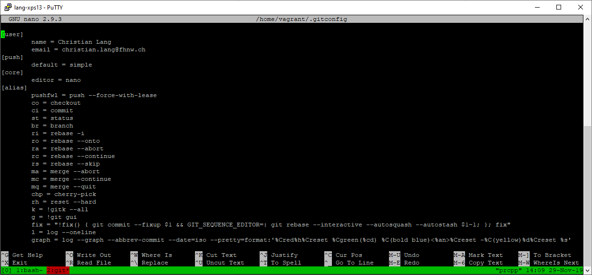
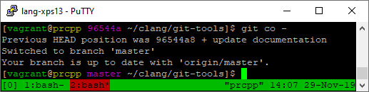
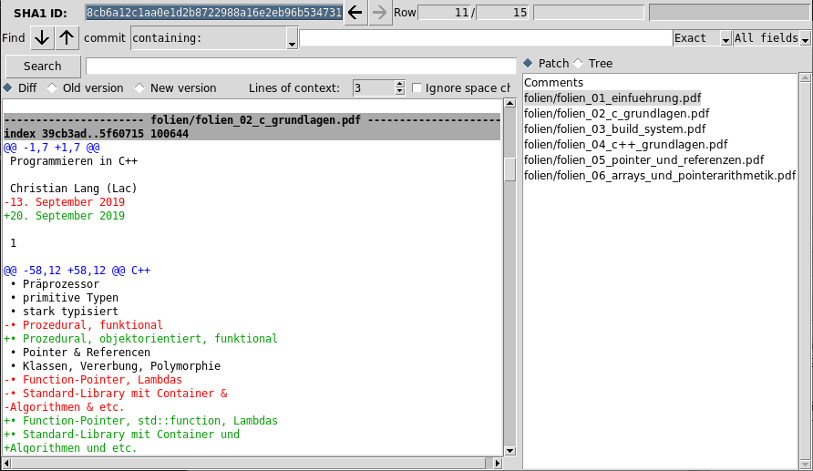
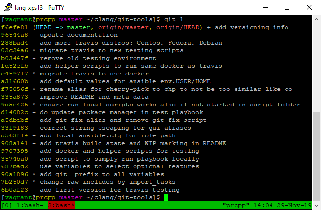
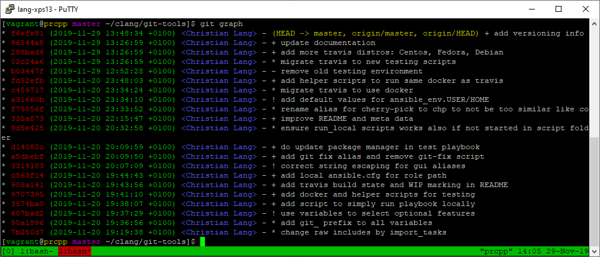

git-tools
=========

Ansible role which does prepare some usual needed settings, aliases and other tools for efficient git usage.

Features
--------

### Aliases

Many small shortcuts for useful commands.
Like `git fix <commit_hash>` which combines a `git commit --fixup` and the corresponding `git rebase -i`.

~~~
// stage your changes e.g. with git gui
$ git gui

// check which commit to fix e.g. with git l
$ git l

// now append the staged changes to the selected commit
$ git fix <commit-hash>

// this results in rebasing and therefore changing the history until the selected commit
~~~

Or `git loc <file_ending>` which shows the count of lines (loc) in files matching the pattern given by `<file_ending>`.

~~~
// count lines in all ".cpp" files
$ git loc cpp

// count lines in all ".cpp" and ".h" files
$ git loc "cpp|h"
// "" or '' are needed to interpret | as part of the regex used internally and not as pipe operator of the shell
~~~

### Prompt

### Additional diffs

Additional diff strategies to be able to also work with some binary files, like:

* `doc`, `docx`
* `xls`, `xlsx`
* `pdf`
* `zip`, `tar`, `bz2`, etc.

### Graphs

Requirements
------------

This role should work on most linux distributions.
Tested on Ubuntu, Centos, Fedora and Debian.
See [`ansible_run.yml`](.github/workflows/ansible_run.yml) for more information about CI-testing.

The only requirements is bash, if the `git_prompt`-feature is activated.

Role Variables
--------------

All variable that may be manipulated by the user are collected in [`defaults/main.yml`](defaults/main.yml) .
See the inline description there.

Dependencies
------------

This role is completely self-containing and has no dependencies to other ansible roles.

Usage
-----

> If you just want to use these tools without creating your own playbook etc.
> you have to just install ansible and then use the described way under [Development-Localhost](#localhost).

See [`testing/playbook.yml`](testing/playbook.yml) for example playbook.

To be able to install the role you can use the command:

~~~
ansible-galaxy install git+https://github.com/langchr86/git-tools.git,master
~~~

or you define it in [`requirements.yml`](https://docs.ansible.com/ansible/latest/galaxy/user_guide.html#installing-multiple-roles-from-a-file):

~~~
- src: 'https://github.com/langchr86/git-tools.git'
  version: 'master'
~~~

and then install with:

~~~
ansible-galaxy install -r requirements.yml
~~~

Development
-----------

### Docker

To develop and test this role the docker infrastructure, which is also used by travis, can be used.
Ubuntu is used as distro by default.

~~~ {.bash}
# Build the docker image.
./testing/1_create.sh

# Create docker container and run it with the correct mounted volumes.
./testing/2_run.sh

# Connect into the container.
./testing/3_connect.sh

# Now you are logged-in the docker container.

cd /etc/ansible/roles/git-tools/
./testing/4_test.sh

# Now the example playbook should run and you can test the installed features.

# Leave the container with the following command when you are finished developing/testing.
exit

# Remove all signs of the docker container.
./testing/5_remove.sh
~~~

### Localhost

To be able to test with GUI tools you need to test on a system with X11 capabilities.
Usually this is your localhost.
Ensure you have correctly installed `ansible` on your machine.

To run the example playbook you can checkout the repo,
adapt [`testing/playbook.yml`](testing/playbook.yml)
and run it on localhost by using [`run_local.sh`](run_local.sh).

License
-------

MIT

Versioning
----------

There exists no version numbers, releases, tags or branches.
The master should be considered the current stable release.
All other existing branches are feature/development branches and are considered unstable.

Author Information
------------------

Christian Lang
[lang.chr86@gmail.com](mailto:lang.chr86@gmail.com)
